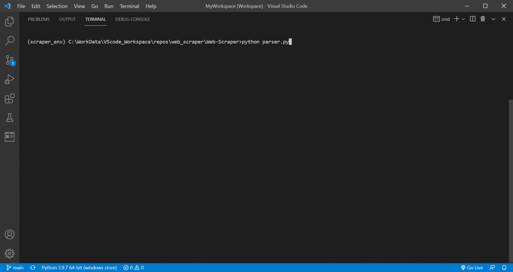
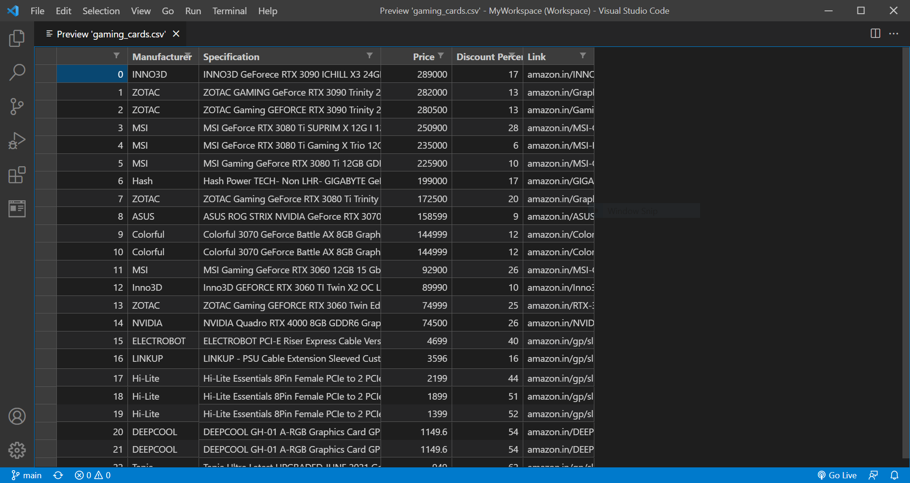

# Web Scraper 

## Webscraper for Amazon.in using beautiful soup and pandas. 

## Usage 

 
 

## Final CSV file for analysis

## Instructions to run locally 

- git clone https://github.com/prithvijitguha/Web-Scraper.git
- cd Web-Scraper 
- pip install -r requirements.txt 
- python parser.py 

